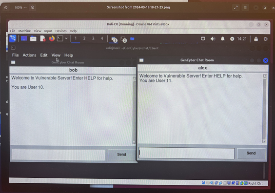
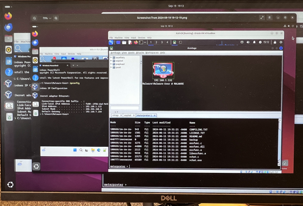

# Ethical Hacking via Armitage 🛡️

Simulated real-world penetration testing against Windows 10 and XP VMs using Kali Linux, Metasploit, and Armitage. Developed and executed full attack chains from exploitation to post-exploitation in a sandboxed academic lab.

## 🔧 Tools & Tech
- Kali Linux, Armitage, Metasploit Framework
- VirtualBox (Windows 10, XP)
- SysInternals, Wireshark, Python

## 🔍 Key Features
- MS08-067 & EternalBlue exploits (RCE)
- Meterpreter: Webcam hijack, keylogger, user enumeration
- Session hijack in a multi-user client/server chat room
- Persistent access via startup and autorun techniques

## 📁 Screenshots

## 📚 Notes
This was completed as part of a Digital Forensics course at UMass Lowell. All testing was done in a secure, air-gapped virtual environment.
